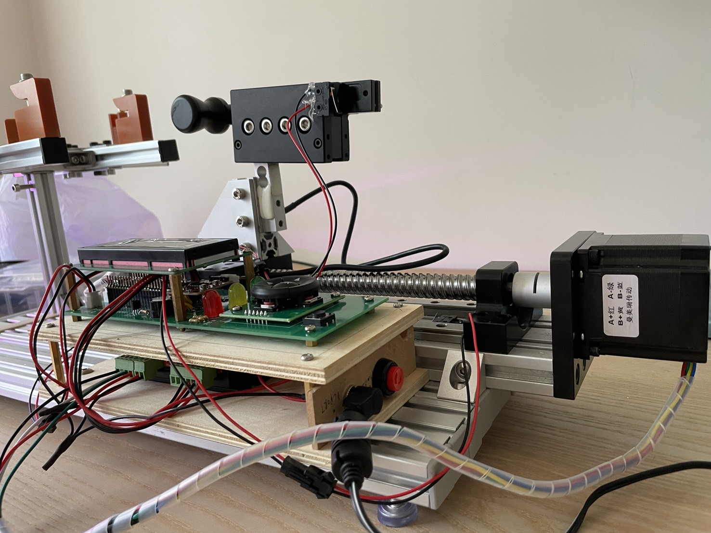

# Pico Stringer

The project is my version of how to make a badminton stringer, based on [PicoBETH](https://github.com/206cc/PicoBETH) DIY badminton stringer prjoect. 
I published the assemable guildline on [Instructables](https://www.instructables.com/DIY-Electric-Badminton-Stringers/). 

## Modification
Compare to original PicoBETH project, several modifications are listed below. 

### Hardware:
1. Based on a simple badminton stringer, which I bought from [Taobao](https://item.taobao.com/item.htm?_u=t20cga269s9bcb&id=737728917603&spm=a1z09.2.0.0.3fa02e8dvmYHSh). the stringer is made mostly by 2020 and 2060 alumium extrusions.

2. Applying extra 2060 alumium extrusions and alumium extrusion parts as the project's platform.
3. GX-80 1610 double-guided liner guideway with 200mm stroke is adopted.
4. Change Stepper motor driver to DM542C stepper driver.
In my past experience, DM542C could run stepper motor smoother and quieter then TB6600. It also supports more microstep and current adjuestments.

5. Custom-designed PCB board.
6. Intergrated HX711 layout based on [Sparkfun hx711 module](https://www.sparkfun.com/products/13879)

PCB V2.0 Updated:
1. Shrink PCB size to 55.00 x 176.00 mm
2. Extra 12V power pin is preserved for further stepper motor driver development.
3. rearrangement of connector pin.
4. 5-way switch intergrated.
5. polygon poured on both side.

### Software:
[main.py]() is slightly modified to fit DM542C driver.

## Worning

I improved the stringer's strength before I start the project. If your stringer is not robost, I strongly advise against undertaking this project. A weak stringer platform might deform after applying tension, causing the racket frame to deform into round shape or even damage the racket.

## Documents

1. Schmatic diagrams

2. GERBER file
3. BOM of customized pcb board
4. BOM of stringer platfrom hardware
5. Softwares 
## Acknowledgements

 - [PicoBETH](https://github.com/206cc/PicoBETH)
 - [Simple badmintion Stringer](https://item.taobao.com/item.htm?_u=t20cga269s9bcb&id=737728917603&spm=a1z09.2.0.0.3fa02e8dvmYHSh)
 - [Sparkfun HX711](https://www.sparkfun.com/products/13879)
 - [Micropython - hx711-pico-mpy](https://github.com/endail/hx711-pico-mpy)
 - [Micropython - RPI-PICO-I2C-LCD](https://github.com/T-622/RPI-PICO-I2C-LCD)
 

## Support

For support, feel free to contact me through bill10361239@gmail.com.

## Authors

- [@HsuKaoPang](https://www.github.com/HsuKaoPang)

